# MLOPS Итоговое домашнее задание
## Этап 1. Развертывание MLflow
### Артефакты
Каталог `./1_mlflow`  
### Скриншоты
*Логи сервисов*
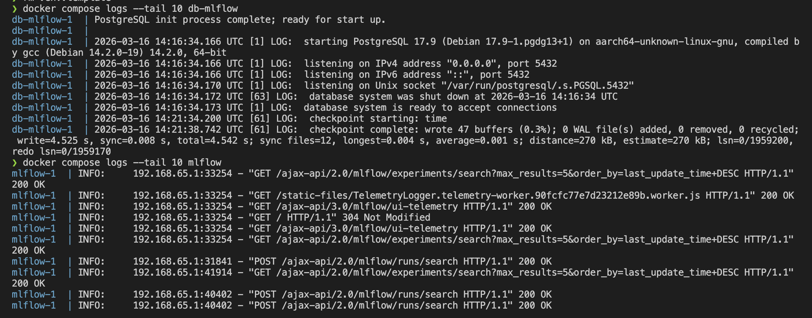

*Эксперимент создан*
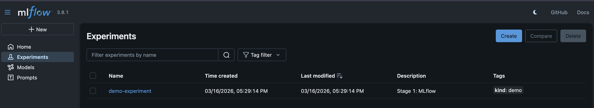

## Этап 2. Развертывание Airflow
### Артефакты
Каталог `./2_airflow`  
Даг `./2_airflow/data/airflow/dags/firstproj`
### Скриншоты
*Логи сервисов*
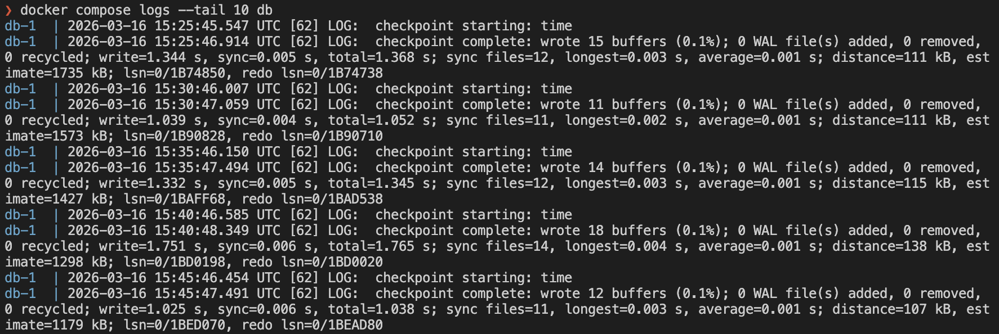
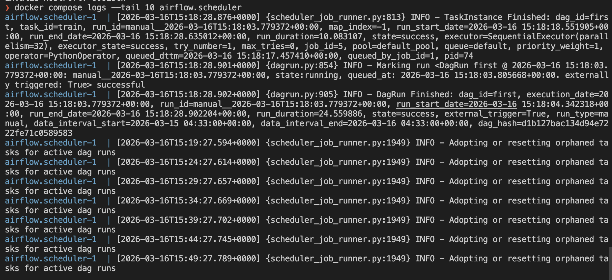

*Демо даг выполнен*
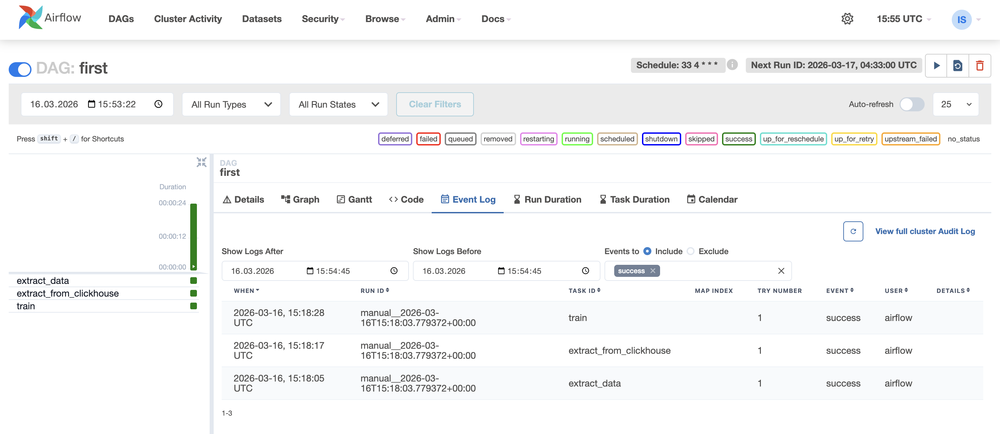

## Этап 3. Развертывание LakeFS
### Артефакты
Каталог `./3_lakefs`
### Скриншоты
*Логи сервисов*
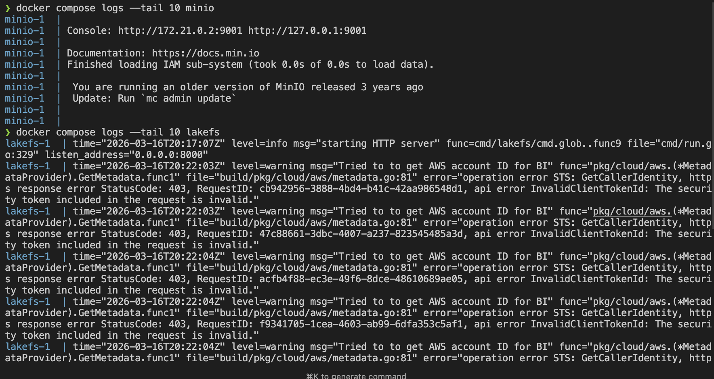

*Lakefs diff*
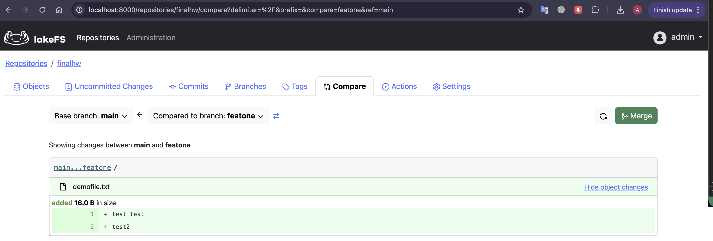

## Этап 4. Развертывание JupyterHub
### Артефакты
Каталог `./4_jupyterhub`
### Скриншоты
*Логи сервисов*
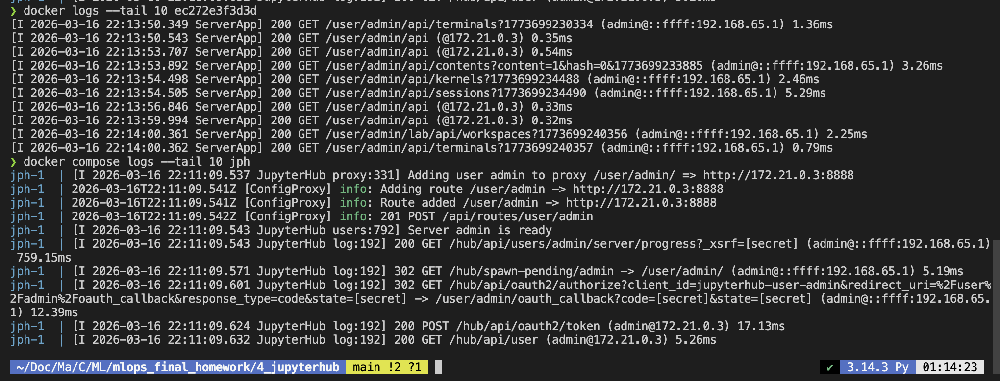

*Скрин запущенного сервиса*
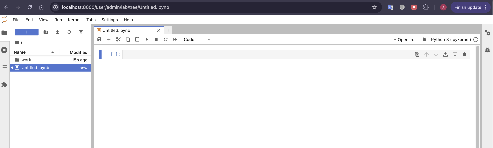

## Этап 5. Развертывание ML-сервиса
### Артефакты
Каталог `./5_mlservice`
### Скриншоты
*Логи сервисов*
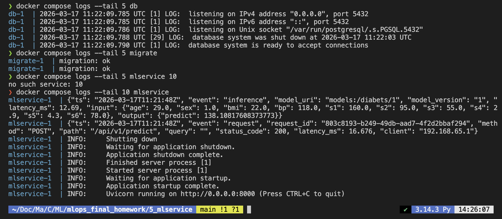

*Тесты запросов*
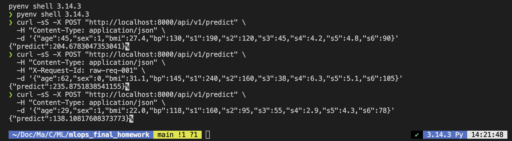

*Логи работы модели в БД*
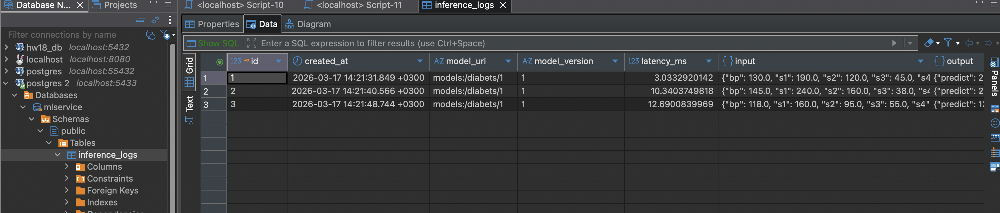

## Этап 6. Метрики развернутого сервиса
### Артефакты
Cервис с endpoint /metrics `./6_metrics/mlservice`
Prometheus + Grafana `./6_metrics/metrics`
### Скриншоты
*Логи сервисов*
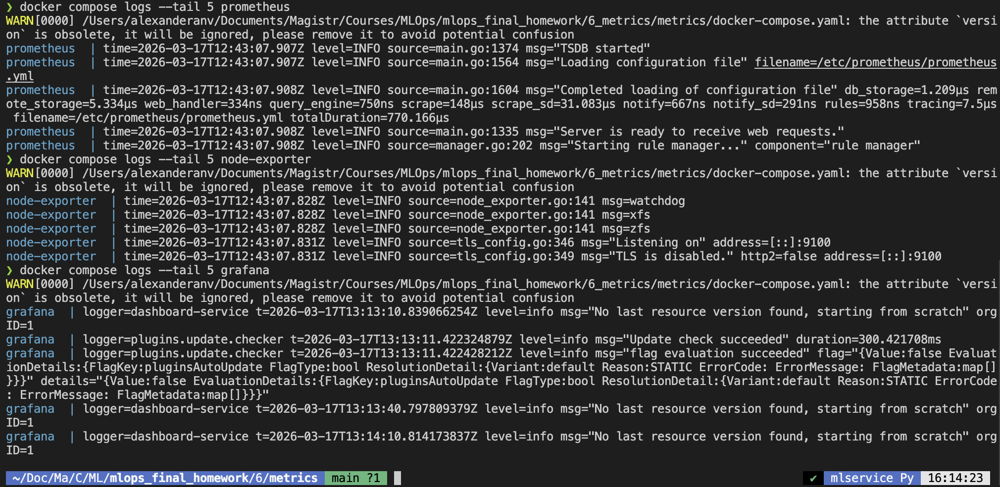

*Дашборд Grafana*
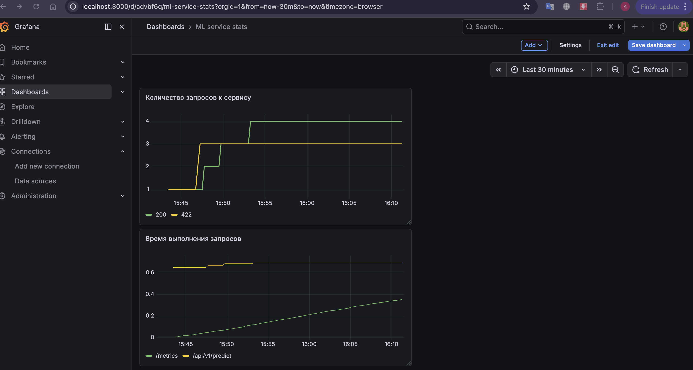